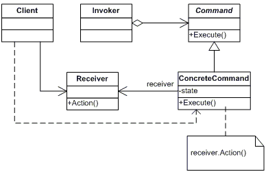

# [Команда](CommandDemo.java)
Это поведенческий паттерн, который преобразует запросы в объекты. 
Он создает структуры, в которых класс-отправитель и класс-получатель 
не зависят друг от друга напрямую.

## Структура

## Когда использовать
+ Когда вы хотите параметризовать объекты выполняемым действием
+ Когда вам нужно ставить операции в очередь, передавать их по сети или выполнять
+ Когда нужна многоуровневая операция отмены
  
## Преимущества
+ Исключает прямую зависимость между вызывающими операции объектами и теми которые их выполняют
+ Возможность выполнять отмену и повтор действий
+ Возможность реализовать сложные операции из простых запросов
+ Возможность реализовать отложенный запуск операции
+ Соответствует второму принципу SOLID. Принципу открытости-закрытости

## Недостатки
+ Усложняет код программы из-за добавления новых классов