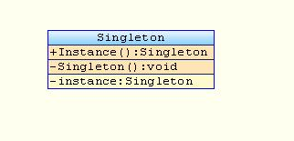

# [Одиночка](SingletonDemo.java)
Это порождающий паттерн проектирования, который гарантирует, что у класса
есть только один экземпляр, и предоставляет к нему глобальную точку доступа

## Структура

## Когда использовать
+ Когда в программе должен быть единственный экземпляр какого-то класс, 
  доступный всем клиентам
+ Когда вам хочется иметь больше контроля над глобальными переменными
+ Многие программисты считают Одиночку антипаттерном, поэтому его всё
  реже и реже можно встретить в Java-коде.
  
## Преимущества
+ Гарантирует что будет создан только один экземпляр класса
+ Предоставляет к нему глобальную точку доступа
+ Реализует отложенную инициализацию одиночки

## Недостатки
+ Нарушает первый принцип SOLID. Принцип единственной ответственности
+ Проблемы в многопоточной среде
+ Проблемы при тестировании. Требуется постоянное создание Mock-ов