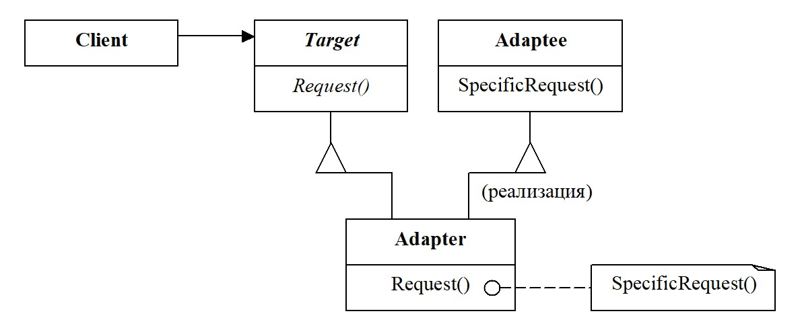

# [Адаптер](AdapterDemo.java)
Это структурный паттерн проектирования, который позволяет объектам с
несовместимыми интерфейсами работать вместе.

## Структура

## Когда использовать
+ Когда вы хотите использовать сторонний класс, но его интерфейс не
  совместим с кодом приложения
+ Когда вам нужно использовать несколько существующих подклассов, но
  в них отсутствует необходимая функциональность, а расширить суперкласс
  вы не можете
  
## Преимущества
+ Отделяет и скрывает от клиента подробности реализации адаптации

## Недостатки
+ Усложняет код программы из-за добавления новых классов